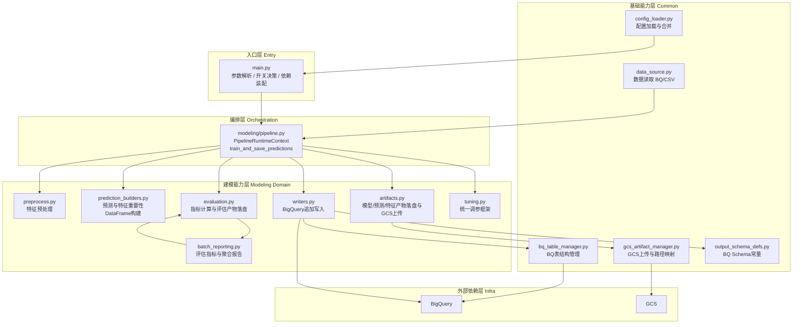
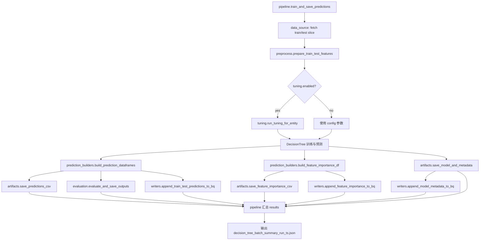

# 整体架构说明

## 1. 目标与设计原则

本项目将批量建模流程拆分为两个目录：

- **`common/`** — 跨场景可复用的基础能力层（数据读取、配置加载、GCS/BQ 基础设施）
- **`modeling/`** — 建模核心业务逻辑层（特征预处理、训练、评估、产物落盘、写库）

设计原则：
- 入口与参数装配放在主脚本（`main.py`）
- 基础设施能力（IO、配置、Schema）收敛在 `common/`，供所有上层模块复用
- 建模流程编排放在 `modeling/pipeline.py`
- 数据构建、评估、产物持久化、写库分别拆分为独立子模块
- 各模块单一职责，`modeling/` 模块只能向下依赖 `common/`，不得反向

---

## 2. common/ 模块职责

`common/` 是纯基础能力包，不包含任何建模业务逻辑，可独立复用。

| 模块 | 主要职责 | 关键函数/对象 |
|---|---|---|
| `config_loader.py` | 统一配置加载入口，合并 system defaults + profile config，返回完整配置字典 | `load_unified_config` |
| `data_source.py` | 建模输入数据读取，支持 BigQuery 宽表和 GCS/本地 CSV，按 entity（`entity_id_columns` 配置的维度组合，如 `sales_channel × hfb × sales_category`）+ 时间窗切分 train/test | `parse_gcs_uri`, `download_gcs_file_to_local` |
| `bq_table_manager.py` | BigQuery 输出表结构校验、建表 SQL 生成、目标表解析（结构不兼容时自动加 run_ts 后缀 fallback） | `TableSpec`, `resolve_bq_table` |
| `gcs_artifact_manager.py` | 本地产物到 GCS 的路径映射与上传，保证本地/GCS 目录结构同构 | `upload_dir_to_gcs`, `upload_file_to_gcs_by_model` |
| `output_schema_defs.py` | 三张 BQ 输出表的 Schema 常量定义（预测明细、模型元数据、特征重要性） | `PRED_SCHEMA_DEFS`, `MODEL_META_SCHEMA_DEFS` |
| `__init__.py` | 当前为空，common 各模块按需直接导入 | — |

---

## 3. modeling/ 模块职责

`modeling/` 承载决策树批量建模的核心业务逻辑，依赖 `common/` 提供的基础能力。

| 模块 | 主要职责 | 关键函数/对象 |
|---|---|---|
| `pipeline.py` | 建模主流程编排，串联所有子模块 | `PipelineRuntimeContext`, `train_and_save_predictions` |
| `preprocess.py` | 特征预处理，将混合类型特征转为模型可用数值数组 | `prepare_train_test_features` |
| `prediction_builders.py` | 预测结果与特征重要性 DataFrame 构建 | `build_prediction_dataframes`, `build_feature_importance_df` |
| `evaluation.py` | 指标计算与评估产物（JSON/CSV）落盘 | `evaluate_and_save_outputs` |
| `artifacts.py` | 模型文件、模型元数据、预测明细、特征重要性产物落盘与可选 GCS 上传 | `save_model_and_metadata`, `save_predictions_csv`, `save_feature_importance_csv` |
| `writers.py` | BigQuery 追加写入适配层 | `append_train_test_predictions_to_bq`, `append_model_metadata_to_bq`, `append_feature_importance_to_bq` |
| `tuning.py` | 统一调参框架，支持 Random Search / Grid Search，按 entity 选出最优超参数 | `run_tuning_for_entity` |
| `batch_reporting.py` | 评估汇总与报表输出，计算 MAE/RMSE/MAPE/WAPE/sMAPE 及准确率标志位，生成分层聚合报告 | `compute_flags`, `compute_metrics`, `generate_same_structure_report` |
| `__init__.py` | 对外导出 modeling 公共 API | `PipelineRuntimeContext`, `train_and_save_predictions` 等 |

---

## 4. 整体分层视图



---

## 5. 单 item 主流程顺序

每个 item（entity）的处理顺序：

1. `main.py` 通过 `config_loader` 加载配置，通过 `data_source` 读取全量数据
2. `pipeline` 按 entity（`entity_id_columns` 定义的维度组合）切分 train/test 数据切片
3. `preprocess` 执行特征转换，生成 `x_train / y_train / x_test / y_test`
4. （可选）`tuning` 对当前 item 执行超参搜索，返回最优参数
5. `pipeline` 使用有效参数训练模型并生成预测值
6. `prediction_builders` 构建 `pred_df`、`pred_all_df`、`feat_imp_df`
7. `artifacts` 落盘模型与预测文件，并按开关上传 GCS
8. `evaluation` 计算指标并落盘评估文件
9. `writers` 按开关将预测明细、模型元数据、特征重要性写入 BigQuery
10. `pipeline` 汇总 item 结果，最终输出 batch summary



---

## 6. 依赖方向规则

```
main.py
  └─> common/config_loader      （配置加载）
  └─> modeling/pipeline          （建模编排）

modeling/pipeline
  └─> common/data_source         （数据读取）
  └─> modeling/preprocess
  └─> modeling/prediction_builders
  └─> modeling/evaluation
  └─> modeling/artifacts
  └─> modeling/writers
  └─> modeling/tuning

modeling/evaluation
  └─> modeling/batch_reporting

modeling/artifacts
  └─> common/gcs_artifact_manager

modeling/writers
  └─> common/bq_table_manager
  └─> common/output_schema_defs
```

**禁止：**
- `modeling/` 子模块反向依赖 `pipeline.py`
- `modeling/` 子模块之间形成循环依赖
- `common/` 模块依赖 `modeling/` 任何模块

---

## 7. RuntimeContext 说明

`PipelineRuntimeContext`（`modeling/pipeline.py`）用于收敛运行态共享信息，避免 pipeline 依赖主脚本全局变量。

当前包含：
- `run_ts`
- `out_dir`
- `project_id`
- `source_ref`
- `gcs_output_uri`
- `dt_params`

后续如继续拆分，可优先通过扩展 RuntimeContext 传递上下文，而不是新增模块级全局变量。

---

## 8. 后续演进建议

- 可新增 `modeling/trainers.py`，封装模型实例化与训练细节，将 pipeline 进一步精简
- 可新增 `modeling/domain_types.py`，统一定义各阶段返回结构（替代 dict 传递）
- 可新增 `common/validation.py`，集中处理输入数据与配置校验
- 若未来引入多模型，可把 pipeline 抽象为通用骨架，再按模型类型实现策略层
- `common/data_source.py` 可进一步拆分为 `bq_source.py` 和 `csv_source.py`

---

## 9. 变更规范

适用范围：
- 新增 `common/*.py` 或 `modeling/*.py` 模块
- 调整模块职责边界（函数迁移、拆分、合并）
- 改动 pipeline 的调用链路或返回结构

必须同步更新本文件的对应章节：
- 「2. common/ 模块职责」或「3. modeling/ 模块职责」表格
- 若流程顺序变化，更新「5. 单 item 主流程顺序」步骤与流程图
- 若依赖变化，更新「6. 依赖方向规则」
- 若上下文字段变化，更新「7. RuntimeContext 说明」

提交前检查清单：
- [ ] 新模块是否只负责一个能力域
- [ ] `common/` 新模块是否不依赖 `modeling/`
- [ ] pipeline 是否仅做编排，不再内联实现细节
- [ ] `docs/01_architecture.md` 是否已同步更新
- [ ] 关键文件是否通过错误检查
- [ ] 是否完成最小运行验证（`--max-entities=1` 或 dry-run）

---

## 10. 最小重构模板（PR）

推荐 PR 标题：
- `refactor(modeling): extract <能力域> from pipeline`
- `refactor(common): add <基础能力> module`

推荐 PR 描述结构：
1. 背景：当前痛点（函数过长、职责混杂、难测试）
2. 目标：本次仅拆分哪个能力域
3. 变更范围：新增文件、改动文件、未改动范围
4. 行为影响：声明"无业务逻辑变更"或列出差异
5. 验证结果：静态检查、最小运行验证

最小验收标准（DoD）：
- 代码层：新模块职责清晰，无新增循环依赖，依赖方向合规
- 行为层：外部 CLI 参数与输出产物命名不变（除非 PR 明确声明）
- 文档层：`docs/01_architecture.md` 对应章节与代码一致
- 验证层：至少一次最小冒烟验证并记录结果

---

## 11. config/ 目录说明

配置采用**两层结构**，由 `common/config_loader.py` 在运行时合并：

```
config/
├── system/
│   └── scenario_defaults.yaml      ← 第一层：平台管理，定义所有 scenario 的默认行为
└── profiles/
    ├── item_channel_ma_week/
    │   └── config_v001.yaml        ← 第二层：用户管理，定义业务参数与模型参数
    └── item_day/
        └── config_v001.yaml
```

**第一层 `system/scenario_defaults.yaml`（平台管理）**

定义所有可用 scenario 的 `source_mode` / `storage` 开关默认值。用户不应直接编辑，由平台维护。示例：

```yaml
scenario_profiles:
  bq_local_local:           # BQ 读 → 本地执行 → 本地存
    source_mode: bq
    storage:
      store_pred_to_bq: false
      store_pred_to_gcs: false
      ...
  bq_gcp_bq:                # BQ 读 → GCP 执行 → BQ 写回
    source_mode: bq
    storage:
      store_pred_to_bq: true
      store_pred_to_gcs: true
      ...
```

**第二层 `config/profiles/<model_line>/config_v001.yaml`（用户管理）**

定义业务参数与模型参数，可覆盖 system defaults 中的部分 scenario 字段。主要包含：

| 配置块 | 说明 |
|---|---|
| `versioning` | model_line、runtime_version、model_params_version 等版本元数据 |
| `runtime` | entity_id_columns、features、time_windows、label_column、min_train_rows 等业务参数 |
| `model` | active 算法、各算法超参数（`decision_tree` / `lightgbm` 等） |
| `bq_tables` | 输出表名（bq_pred_table、bq_model_meta_table、bq_feat_imp_table） |
| `scenario_profiles` | 可选：覆盖 system defaults 中的特定 scenario 字段（如 source_table、local_output_dir） |

详细参数说明见：[02_config_guide.md](02_config_guide.md)

---

## 12. main.py 说明

`main.py` 是整个建模包的**唯一 CLI 入口**，负责参数解析、配置装配、依赖初始化，然后将控制权交给 `modeling/pipeline.py`。

**CLI 参数：**

| 参数 | 必填 | 说明 |
|---|---|---|
| `--scenario` | ✅ | 执行场景键，如 `bq_local_local`、`bq_gcp_bq` |
| `--config` | 否 | profile config 路径，默认 `config/profiles/item_channel_ma_week/config_v001.yaml` |
| `--model-type` | 否 | 覆盖 `model.active`，指定算法（`decision_tree` / `lightgbm`） |
| `--max-entities` | 否 | 限制处理实体数量，调试用 |
| `--dry-run` | 否 | 仅上传标记文件到 GCS，验证连通性 |

**main.py 内部职责：**

1. 加载并合并配置（`load_unified_config`）
2. 解析 scenario profile，确定 source_mode / storage 开关
3. 初始化 BigQuery Client（仅在需要时）
4. 读取源数据 / 识别可用特征列
5. 解析 entity 列表（手工清单或自动 discovery）
6. 解析 BQ 输出表（`resolve_bq_table`）
7. 构建 `PipelineRuntimeContext`，调用 `train_and_save_predictions`
8. 调用 `generate_same_structure_report` 生成评估报告
9. 写 run_registry.csv、保存 run_summary.json
10. 可选全量 GCS 镜像同步（`gcs_sync_local_outputs`）
11. 生成 artifact_manifest.json

---

## 13. runners/ 目录说明

`runners/` 存放所有可直接执行的运行入口，包括 PowerShell 封装脚本和数据准备工具。

```
runners/
├── run_item_day_v001.ps1                      ← item_day 模型线简单运行封装
├── run_item_channel_ma_week_v001.ps1          ← item_channel_ma_week 模型线简单运行封装
├── run_item_channel_ma_week_full_dt_lgbm.ps1  ← 并行运行 DT + LightGBM 两个算法
├── run_item_channel_ma_week_full_dt_then_lgbm.ps1  ← 串行运行 DT → LightGBM（含心跳监控）
└── export_source_data_to_gcs.py               ← 从 BQ 导出源数据到 GCS（CSV 场景数据准备）
```

**PS1 封装脚本**：本质是对 `python main.py --scenario ... --config ...` 的封装，目的是固化常用参数组合、避免每次手动输入长命令。`full_dt_lgbm` 和 `full_dt_then_lgbm` 支持通过 `$AlgorithmMode` 参数选择只跑 DT、只跑 LightGBM 或两者都跑。

**`export_source_data_to_gcs.py`**：在使用 CSV 场景（`source_mode=csv`）之前，需要先把 BigQuery 源表数据导出为 CSV 上传到 GCS；本脚本封装这一数据准备步骤。详见 [03_execution_guide.md](03_execution_guide.md)。
