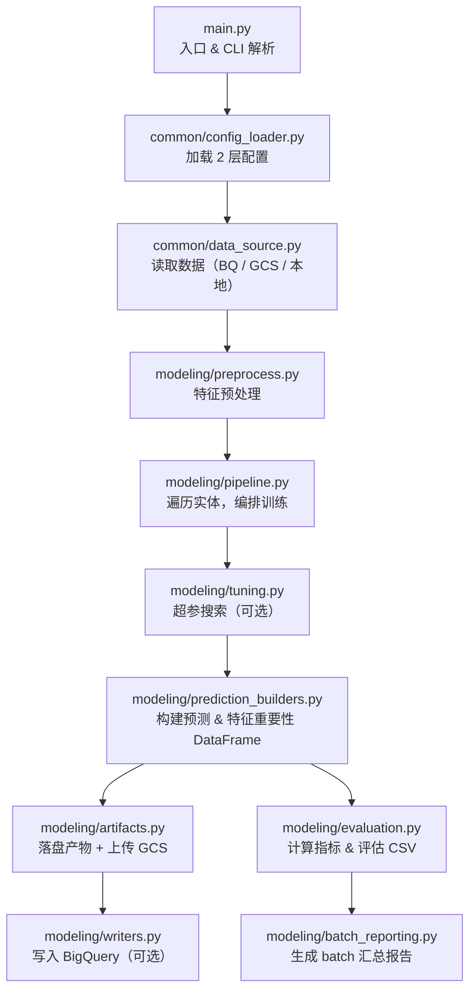

# gcp_python_modeling — 批量建模包文档总览

本包实现了基于 BigQuery / GCS / 本地 CSV 的**批量销量预测建模**完整流程，支持 Decision Tree 与 LightGBM 双算法，可在本地或 GCP Cloud Run 上运行。

---

## 一、包的用途

| 功能 | 说明 |
|------|------|
| 批量多商品建模 | 按实体（如 item_no × 渠道 × 区域）逐一训练独立模型 |
| 多场景数据读写 | 支持 BigQuery 读取、GCS CSV 读取、本地 CSV 读取 |
| 双算法支持 | Decision Tree（已实现）/ LightGBM（已实现） |
| 超参调优 | 支持随机搜索 / 网格搜索，目标优先级可配置 |
| 多维评估 | MAE / RMSE / WAPE / 准确率口径，支持基线对标 |
| 产物管理 | 本地落盘 + 可选 GCS 归档 + 可选 BigQuery 写入 |
| 断点续跑 | 每个 entity 训练后自动写 checkpoint；支持 `--resume-run-id` 从中断处继续，跳过已完成实体 |

---

## 二、一次 Batch 预测的完整逻辑流程

### 2.1 流程概览



### 2.2 步骤与文件对照

| 步骤 | 描述 | 实现文件 |
|------|------|---------|
| 1 | CLI 参数解析，配置场景（bq_local_local / bq_gcp_bq / ...），装配依赖 | `main.py` |
| 2 | 加载 profile config（用户层）+ system scenario_defaults（系统层） | `common/config_loader.py` |
| 3 | 按场景连接数据源，读取特征宽表 | `common/data_source.py` |
| 4 | 对特征列做类型统一、缺失值处理，生成训练矩阵 | `modeling/preprocess.py` |
| 5 | 遍历实体列表，切分 train / validation / test，编排全流程 | `modeling/pipeline.py` |
| 6 | （可选）按实体做超参随机 / 网格搜索，输出最优参数 | `modeling/tuning.py` |
| 7 | 将预测结果和特征重要性组装为 DataFrame | `modeling/prediction_builders.py` |
| 8 | 将模型 .pkl、预测 CSV、元数据 JSON 写入本地；按开关上传 GCS | `modeling/artifacts.py` |
| 9 | 计算 MAE / RMSE / WAPE / 准确率，输出评估 CSV | `modeling/evaluation.py` + `modeling/batch_reporting.py` |
| 10 | 按开关将 5 张表追加写入 BigQuery（`bq_gcp_bq` 场景）：预测明细、模型元数据、特征重要性已有物理表；实体级指标（`dt_metrics_by_split`）与 run 级指标（`dt_run_eval_metrics`）函数已实现，首次运行时自动建表 | `modeling/writers.py` |

---

## 三、快速执行

→ 查看完整执行指南：[03_execution_guide.md](03_execution_guide.md)

**最简本地调试命令：**

```powershell
cd scripts/gcp_python_modeling
python main.py --scenario bq_local_local --config config/profiles/item_channel_ma_week/config_v001.yaml --max-entities 3
```

**断点续跑（替换为实际 run_id）：**

```powershell
python main.py --scenario bq_local_local --config config/profiles/item_channel_ma_week/config_v001.yaml --max-entities 3 --resume-run-id 20260526_140425_940
```

---

## 四、文档索引

| # | 文档 | 内容 |
|---|------|------|
| 01 | [01_architecture.md](01_architecture.md) | 模块架构、Mermaid 流程图、依赖方向、变更规范 |
| 02 | [02_config_guide.md](02_config_guide.md) | 2 层配置体系详解、CLI 参数、所有 YAML 字段说明 |
| 03 | [03_execution_guide.md](03_execution_guide.md) | 本地调试 / Docker 构建 / Cloud Run 部署 / 错误排查 |
| 04 | [04_output_contract.md](04_output_contract.md) | BQ 表结构、本地/GCS 文件命名、产物清单 |
| 05 | [05_metrics.md](05_metrics.md) | MAE / RMSE / WAPE / 准确率口径定义与计算公式 |
| 06 | [06_tuning_method.md](06_tuning_method.md) | 超参搜索框架、目标优先级、搜索空间配置 |
| 07 | [07_prerequisites.md](07_prerequisites.md) | GCP 权限、本地环境、BigQuery 数据准备 |
